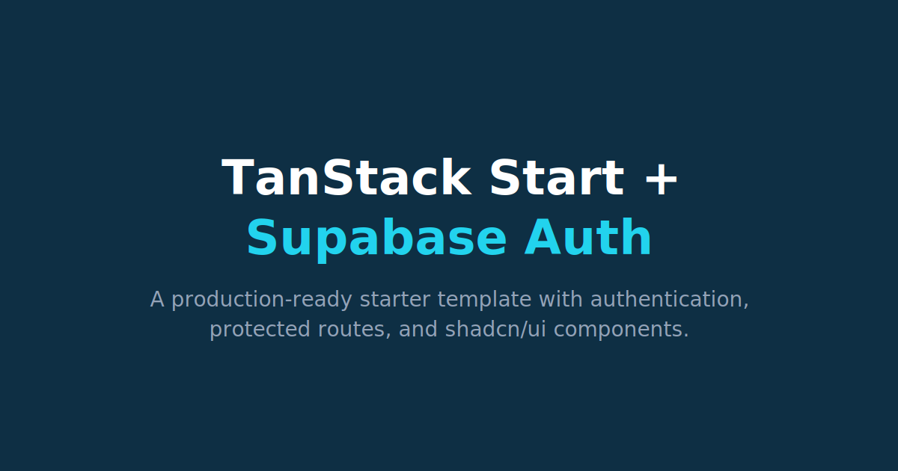

# TanStack Start + Supabase Auth


A starter template demonstrating **TanStack Start** with **Supabase Auth**, protected routes, and **shadcn/ui**.

[](https://tanstack-start-supabase.vercel.app/)

**[Live Demo](https://tanstack-start-supabase.vercel.app/)**

## What's Included

- **TanStack Start** — Full-stack React with file-based routing and SSR
- **Supabase Auth** — Email/password authentication (sign-up, login, password reset)
- **Protected routes** — `/_authenticated` layout guard redirects unauthenticated users
- **shadcn/ui** — Pre-configured with Alert, Button, Card, Dialog, Input, and Label components
- **Tailwind CSS v4** — Utility-first styling
- **Biome** — Linting and formatting
- **Vitest** — Testing framework
- **Playwright** — E2E testing with Chromium
- **CI/CD** — GitHub Actions for checks, E2E tests, and deployment
- **Vercel Analytics** — Automatic page view tracking in production
- **Husky** — Pre-commit hooks

## Prerequisites

- Node.js 18+
- Docker (for local Supabase)

## Setup

```bash
npm install
```

### Start Local Supabase

```bash
npm run db:start
```

### Environment Variables

Copy the templates:

```bash
cp .env.example .env && cp .env.local.example .env.local
```

Fill in your Supabase keys (`.env` for hosted, `.env.local` for local dev).

Get the values from Supabase:

```bash
npx supabase status
```

| Variable                 | Required | Description                             |
| ------------------------ | -------- | --------------------------------------- |
| `VITE_SUPABASE_URL`      | Yes      | Supabase API URL                        |
| `VITE_SUPABASE_ANON_KEY` | Yes      | Supabase anonymous key                  |
| `SUPABASE_SECRET_KEY`    | Yes      | Supabase service role key (for seeding) |
| `VERCEL_TOKEN`           | No       | Vercel deployment token                 |
| `VERCEL_ORG_ID`          | No       | Vercel organization ID                  |
| `VERCEL_PROJECT_ID`      | No       | Vercel project ID                       |

### Reset Database & Seed

```bash
npm run db:reset
```

This runs migrations, generates types, and seeds two test users:

| Email                | Password      | Display Name |
| -------------------- | ------------- | ------------ |
| `user-a@example.com` | `password123` | Alice        |
| `user-b@example.com` | `password123` | Bob          |

### Run Dev Server

```bash
npm run dev
```

The app runs at [http://127.0.0.1:3000](http://127.0.0.1:3000).

## Routes

| Route              | Description                                                       |
| ------------------ | ----------------------------------------------------------------- |
| `/`                | Landing page                                                      |
| `/about`           | About this project                                                |
| `/features`        | Features overview                                                 |
| `/login`           | Sign in / sign up                                                 |
| `/logout`          | Signs out and redirects to `/`                                    |
| `/forgot-password` | Request a password reset email                                    |
| `/reset-password`  | Set a new password (via email link)                               |
| `/dashboard`       | Protected — requires authentication otherwise redirects to /login |

### Local Email Testing

Password reset and confirmation emails are captured by Mailpit:
[http://127.0.0.1:54324](http://127.0.0.1:54324)

## Database

The database has a single `profiles` table that auto-populates via a trigger when users sign up.

### Scripts

```bash
npm run db:start    # Start local Supabase (Docker)
npm run db:stop     # Stop local Supabase
npm run db:reset    # Reset DB, generate types, and seed
npm run db:seed     # Seed test users
npm run db:types    # Regenerate TypeScript types
npm run db:migrate  # Run pending migrations
```

Migrations are in `supabase/migrations/`. Seed data is defined in `supabase/seed-data.ts` (single source of truth) and applied by `supabase/seed.ts`.

## shadcn/ui

Components are in `src/components/ui/`. To add more:

```bash
npx shadcn@latest add <component-name>
```

## Building & Testing

```bash
npm run build       # Production build
npm run test        # Run unit tests (Vitest)
npm run test:e2e    # Run E2E tests (Playwright)
npm run test:e2e:ui # Run E2E tests with interactive UI
npm run typecheck   # TypeScript check
npm run check       # Biome lint + format
```

### E2E Tests

E2E tests use Playwright with Chromium against a local Supabase instance. See `docs/e2e-tests/1-read-me.md` for full documentation.

```bash
# Prerequisites: Supabase running and seeded
npm run db:start
npm run db:reset

# Run tests
npm run test:e2e
```

## Deployment

Configured for Vercel deployment. Set the `VERCEL_*` environment variables and push to trigger the deploy workflow.

## Key Files

| File                                      | Purpose                                      |
| ----------------------------------------- | -------------------------------------------- |
| `src/routes/__root.tsx`                   | Root layout with `AuthProvider`, `Header`, and Vercel Analytics |
| `src/routes/_authenticated.tsx`           | Auth guard layout for protected routes       |
| `src/routes/_authenticated/dashboard.tsx` | Example protected page                       |
| `src/context/AuthContext.tsx`             | React context for auth state                 |
| `src/utils/supabase.ts`                   | Supabase client singleton                    |

## Learn More

- [TanStack Start](https://tanstack.com/start)
- [Supabase Docs](https://supabase.com/docs)
- [shadcn/ui](https://ui.shadcn.com/)
